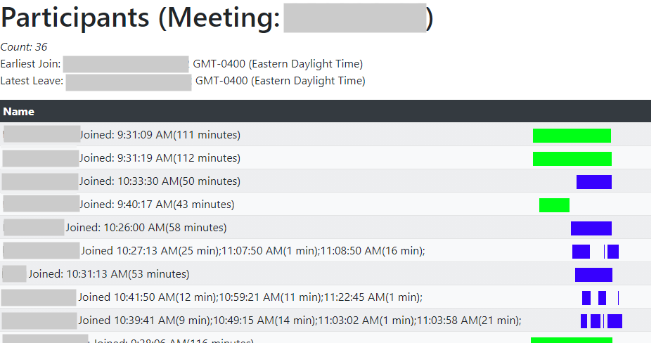

# Project Title

zoomParticipantReport

## Description

Simple Express/Bootstrap5 for listing Zoom meeting participant lists.

## Getting Started

### Dependencies

* JWT App registered on the [Zoom Marketplace](https://marketplace.zoom.us/develop/create)

### Installing

* Clone this repo `git clone https://github.com/balain/zoomParticipantReport.git`
* Create a `config` directory
* Create a `config/default.json` config file containing (at least):
  * APIKey: From Zoom JWT app
  * APISecret: From Zoom JWT app
  * protocol: Either `http` or `https`
    * Setting to `https` requires an `httpsoptions` object containing 2 keys:
      * key: Full path to the privkey.pem file
      * cert: Full path to the fullchain.pem file
  * Optional settings:
    * `meetingIds` array of strings representing the recognized Zoom meeting IDs. If not specified, any meeting ID can be supplied.
    * `port`: Defaults to 9999
    * `authOptions`: If specified, enables Basic Authentication for the specified `users` object (list of usernames (keys) and passwords (values))

### Executing program

* `npm i` to install required modules
* `node app.js`
* Open `http://localhost:9999/mtg/123456` to see the participant list for meeting ID 123456

## Modules

### Required Modules
* `express`
* `config`: Excellent module by Loren West to provide flexible configuration options. [Home](https://lorenwest.github.io/node-config/)
* `debug`: Extra output to STDOUT
* `jsonwebtoken`: For Zoom app authentication

### Optional Modules
* `express-basic-auth`: (Optional) For basic user authentication

## Help

* Change which configuration file is used (if not `default.json`) by setting `NODE_ENV`. See 
* Enable additional debugging output by setting `DEBUG=*`

## Authors

[Balain](https://github.com/balain/)

## Version History

* 0.1
    * Initial Release

## License

This project is licensed under the MIT License - see the LICENSE.md file for details
